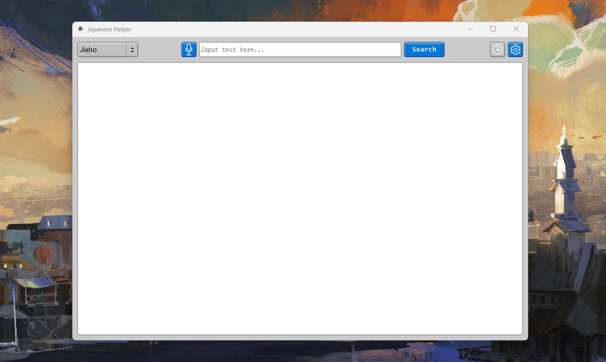
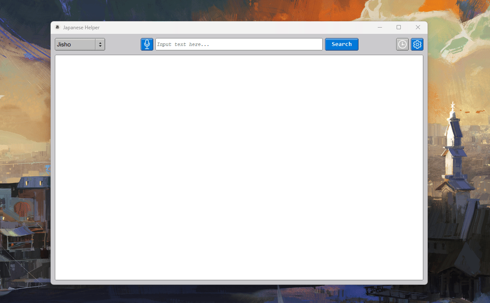

# Japanese Helper

A **minimalistic** desktop application for Japanese vocabulary lookup and translation.

It has multiple API integrations, a classic-style user interface using FLTK, and speech-to-text. Compatible both with Windows and Linux.

## Preview:



## Usage:

There are 3 APIs integrated into the application:

# 🔍 Lookup

### Jisho

The **Jisho API** can be used to look up any Japanese words in all the writing systems (**Kanji**, **Hiragana**, **Katakana**, and even **Romaji**).

The **API** provides all Japanese words associated with the input text, their reading (in Hiragana), and their different meanings in English.

# 🌐 Translation


### DeepL (Needs API Key)

The **DeepL Translate API can only be used with an API key**. The free version supports up to **500,000 characters a month**.

The key can be input through the settings window `Settings → API → DeepL API Key`.

For more information on the DeepL API key, please visit [here.](https://support.deepl.com/hc/en-us/articles/360020695820-API-key-for-DeepL-API)

### MyMemory

MyMemory is a free, API-keyless alternative to the DeepL API.

The free version allows for **5,000 chars/day**, while inputting your email through `Settings → API → MyMemory Email` raises the limit to **50,000 chars/day**.

For more information on the MyMemory API, please visit [here.](https://mymemory.translated.net/doc/)

## 🗣️ Speech Recognition:

Japanese Helper has a built-in speech recognition, allowing the user to transcribe Japanese speech into text that automatically goes into the search bar (input).



STT uses **whisper.cpp** with the `base` model by default. You can download different model sizes (**tiny**, **base**, **small**, **medium**, **large**) directly from the application via `Settings → Model Download`.

You can also modify the settings and paramaters for **whisper.cpp** and its structs in `speech_to_text.cpp`.
Notably, you can change the language that **whisper.cpp** takes in as input.

## 🖇️ Dependencies:

If you're planning to build this yourself, you'll need these:

- **CMake**

- **GNU Compiler Collection (GCC)**

- **FLTK (Fast Light Toolkit)**

- **libcurl (C/C++ Network Transfer Library)**

- **PortAudio (real-time audio I/O)**

**NOTE:** The `CMakeLists.txt` file sort of handles the acqusition of necessary dependencies.

## 🔨 Building:

There is a `CMakeLists.txt` in the root directory of the project. It can be used to build the program as is, however if you plan on making any changes, be sure to update it if necessary.

### Step-By-Step Instructions:

1. First clone the repository.
- **Ensure** "--recurse-submodules" is included in the command to clone the necessary dependency repositories.
  
  ```bash
    git clone --recurse-submodules https://github.com/mk-babian/japanese-helper.git
  ```

- For building with a single command, run this (in the `root` directory):
  
  ```bash
  cmake -S . -B build/ -DCMAKE_BUILD_TYPE=Release && cmake --build build/ && ./build/translator
  ```
  
  ##### Note on Whisper.cpp:

- By default, Japanese Helper uses the `base` model of Whisper.cpp.

- You can download additional Whisper models from the application:
  - Navigate to `Settings → Model Download`
  - Select your desired model size and download
  
  Alternatively, you can use the command below to download the model:
  
  ```bash
  cmake --build build/ --target download_whisper_model
  ```

## ⚙️ Configuration & Misc:
Add your DeepL API key under `Settings → API`.

Your search history and settings are saved in the user's local data directory:
- **Windows**: `%APPDATA%/Japanese Helper/`
- **Linux**: `$HOME/.config/japanese-helper/` or `$XDG_CONFIG_HOME/japanese-helper/`

History entries can be interacted with:
- **Hover** to see more info
- **Click** to re-search a previous query
- **Clear History** button to wipe it clean from `Settings → History`

Example of the `history.json` file:
```json
{
    "api": [
        0
    ],
    "search": [
        "ばか"
    ],
    "time": [
        "Wednesday, May 06 03:33 PM"
    ]
}
```
**NOTE:** The history file and buffer only hold 100 entries. This can be changed by resizing the vectors in `main.cpp`.

## 🙏 Acknowledgments:

- Big thanks for Georgi Gerganov [(ggerganov)](https://github.com/ggerganov) and contributors of **whisper.cpp** for creating an accessible and high-performance automatic speech recognition (ASR) model.

- Thanks to the [MyMemory](https://mymemory.translated.net/doc/) API, we can be allowed quick and easy access to a translation service without the need to get an API key.

## 📜 License:

PolyForm Noncommercial License 1.0.0 - See `LICENSE` file.

Copyright (c) 2025 Saba
