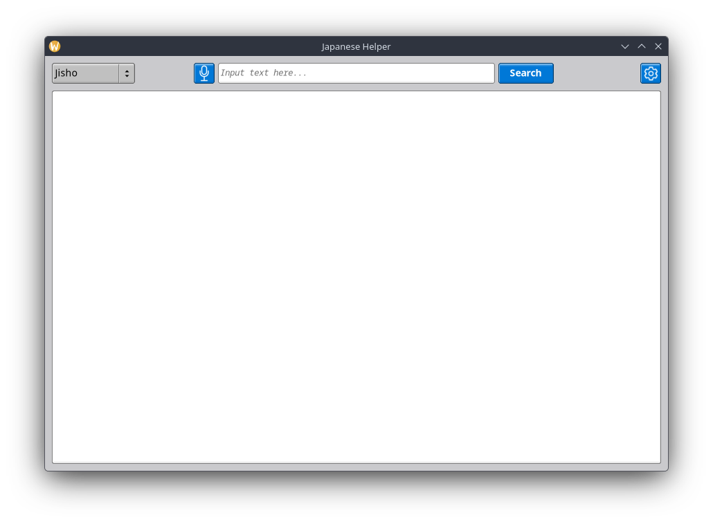
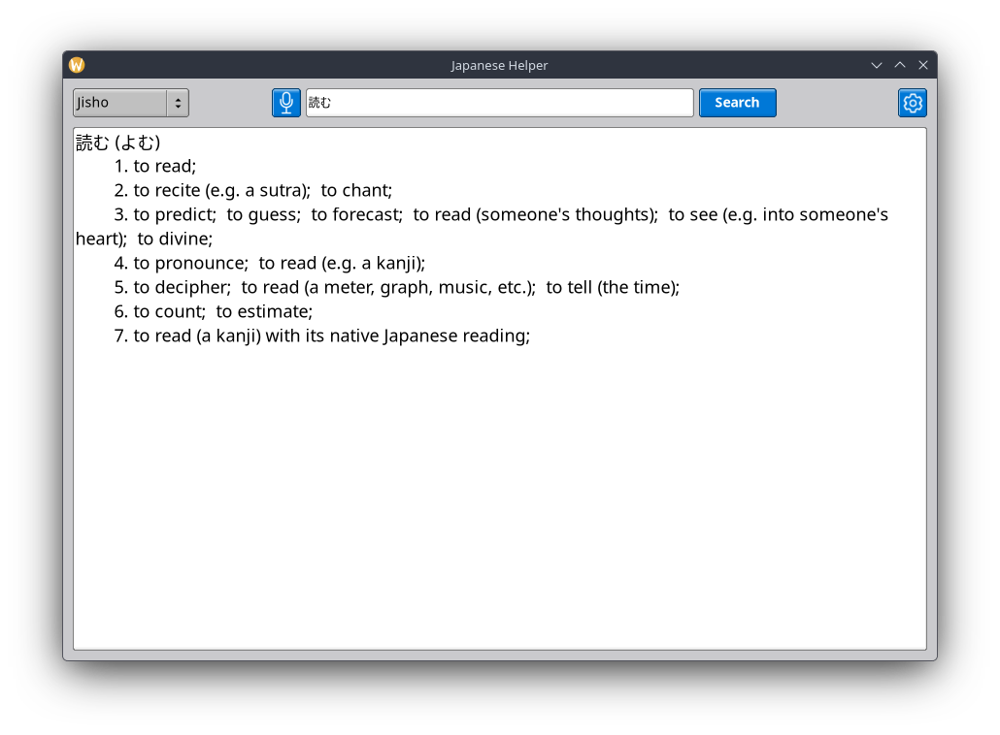

# Japanese Helper

A **minimalistic** desktop application for Japanese vocabulary lookup and translation.

It has multiple API integrations, a classic-style user interface using FLTK, and speech-to-text.

## Screenshot(s):





## Usage:

For now, there are only two API integrations:

### Jisho

The **Jisho API** can be used to look up any Japanese words in all the writing systems (**Kanji**, **Hiragana**, **Katakana**, and even **Romaji**).

The **API** provides all Japanese words associated with the input text, their reading (in Hiragana), and their different meanings in English.

### DeepL (Needs API Key)

This **API** simply translates anything in the input field from Japanese to English.

The **DeepL Translate API** can only be used with an **API key**. The free version supports up to **500,000 characters a month**.

## Speech-To-Text:

Japanese Helper has a built-in speech-to-text, allowing the user to transcribe Japanese speech into text that automatically goes into the search bar (input).

STT uses **Whisper.cpp** with the `base` model. Additional models can be downloaded and configured manually.
For more information on downloading models, please see `README.md` for **Whisper.cpp** or click [here](https://github.com/ggml-org/whisper.cpp/blob/master/README.md#:~:text=Then%2C%20download%20one%20of%20the%20Whisper%20models).

You can also modify the settings and paramaters for **Whisper.cpp** and its structs in `speech_to_text.cpp`.
Notably, you can change the language that **Whisper.cpp** takes in as input.

## Dependencies:

The distribution version that will be uploaded (eventually) doesn't require any other dependencies, except the Windows header files that every Windows system has. It's also bundled with .dll files that are required to run the program.

It's also worth to noting that these fonts are required to be installed on your system:

- **Noto Sans JP**

- **Google Sans Code**

If you're planning to build this yourself, you'll need these:

- **CMake**

- **GNU Compiler Collection (GCC)**

- **FLTK (Fast Light Toolkit)**

- **libcurl (C/C++ Network Transfer Library)**

## Building:

There is a `CMakeLists.txt` in the `src` directory of the project. It can be used to build the program as is, however if you plan on making any changes, be sure to update it.

### Step-By-Step Instructions:

1. First clone the repository.
- **Ensure** "--recurse-submodules" is included in the command to clone the necessary dependency repositories.
  
  ```bash
  git clone --recurse-submodules https://github.com/mk-babian/japanese-helper.git
  ```
2. Run CMake using the following command while in the `src` directory:    
   
   ```bash
   cmake -S . -B ../build -DCMAKE_BUILD_TYPE=Release
   ```
- By default, Japanese Helper uses the `base` model of Whisper.cpp.

- Command to download the base model:
  
  ```bash
  cmake --build ../build --target download_whisper_model
  ```

## Configuration:

For now, there is only one option for configuring the application. You can import your DeepL API key from the settings window.

## License:

MIT License - See `LICENSE` file.

Copyright (c) 2025 Saba
