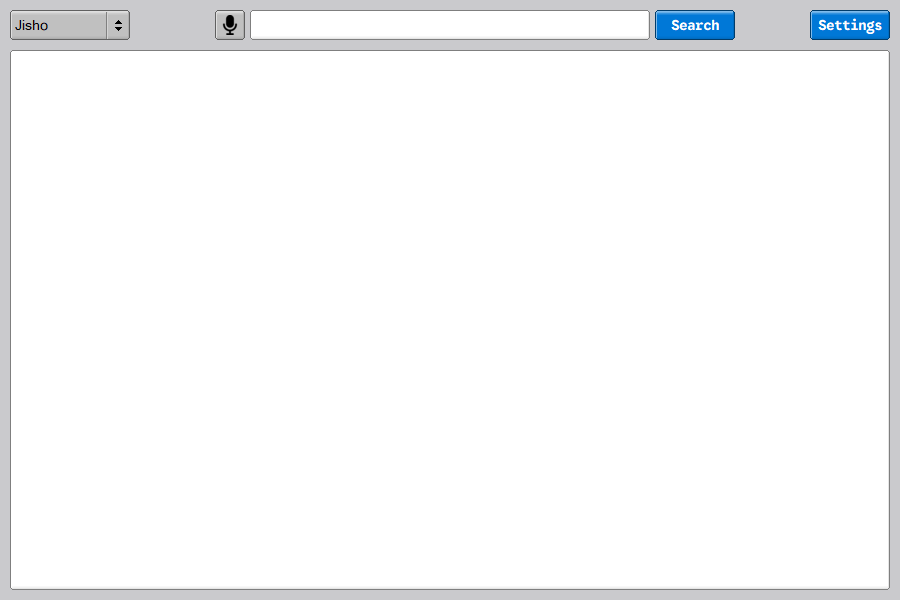
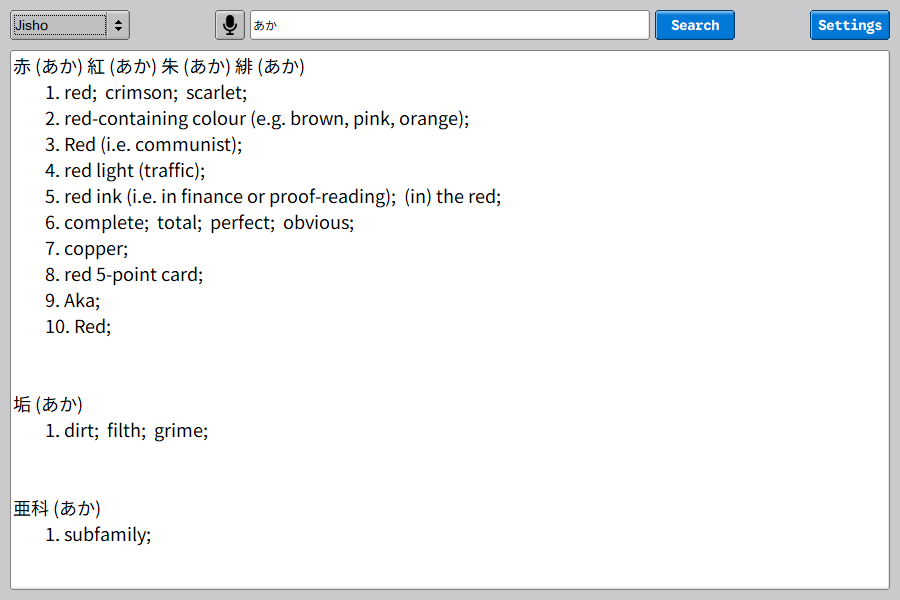

# Japanese Helper

A **minimalistic** desktop application for Japanese vocabulary lookup and translation.

It has multiple API integrations, a classic-style user interface using FLTK, and voice-to-text (WIP).

### Screenshot(s):

---





### Usage:

---

For now, there are only two API integrations:

#### Jisho

The **Jisho API** can be used to look up any Japanese words in all the writing systems (**Kanji**, **Hiragana**, **Katakana**, and even **Romaji**).

The **API** provides all Japanese words associated with the input text, their reading (in Hiragana), and their different meanings in English.

#### DeepL (Needs API Key)

This **API** simply translates anything in the input field from Japanese to English.

The **DeepL Translate API** can only be used with an **API key**. The free version supports up to **500,000 characters a month**.

### Dependencies:

---

The distribution version that will be uploaded (eventually) doesn't require any other dependencies, except the Windows header files that every Windows system has. It's also bundled with .dll files that are required to run the program.

It's also worth to noting that these fonts are required to be installed on your system:

- **Noto Sans JP**

- **Google Sans Code**

If you're planning to build this yourself, you'll need these:

- **GNU Compiler Collection (GCC)**

- **FLTK (Fast Light Toolkit)**

- **libcurl (C/C++ Network Transfer Library)**

- **nlohmann/json (Bringing JSON to C++)**

### Building:

---

There is a `Makefile` in the `src` directory of the project. It can be used to build the program as is, however if you plan on making any changes, be sure to update it.

##### Step-By-Step Instructions:

1. First clone the repository.

```bash
git clone https://github.com/mk-babian/japanese-helper.git
```

2. Make your changes, or leave as is.

3. Do make (make sure you are in the src directory).

```bash
make
```

### Configuration:

---

For now, there is only one option for configuring the application. You can import your DeepL API key from the settings window.

### License:

---

MIT License - See `LICENSE` file.

Copyright (c) 2025 Saba
