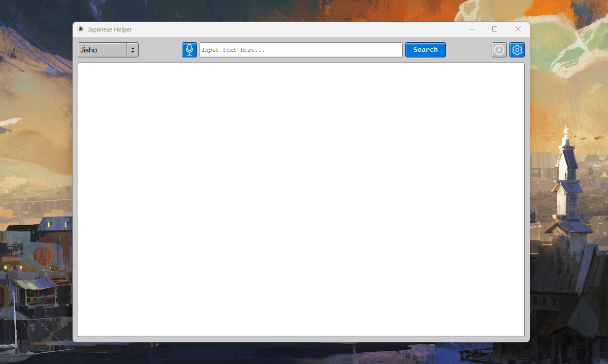
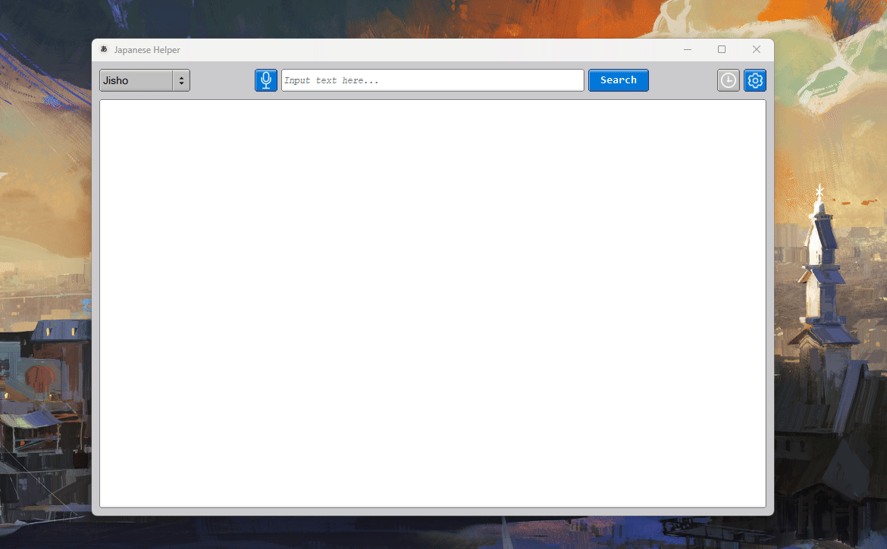

# Japanese Helper

A **minimalistic** desktop application for Japanese vocabulary lookup and translation.

It has multiple API integrations, a classic-style user interface using FLTK, speech-to-text, Anki flashcard export, and a JSON-based theming system. Compatible with both Windows and Linux.

## Preview:



## 📦 Download

Tagged releases are built automatically for Linux and Windows (bundled with the whisper.cpp models directory) via GitHub Actions. Grab the latest zip from the repository's **Releases** page instead of building from source if you just want to run the app.

## Usage:

There are 3 APIs integrated into the application, switchable from the dropdown in the main window or by cycling with **Ctrl+S**:

# 🔍 Lookup

### Jisho

The **Jisho API** can be used to look up any Japanese words in all the writing systems (**Kanji**, **Hiragana**, **Katakana**, and even **Romaji**).

The **API** provides all Japanese words associated with the input text, their reading (in Hiragana), and their different meanings in English.

# 🌐 Translation

### DeepL (Needs API Key)

The **DeepL Translate API can only be used with an API key**. The free version supports up to **500,000 characters a month**.

The key can be input through the settings window `Settings → API → DeepL API Key`.

For more information on the DeepL API key, please visit [here.](https://support.deepl.com/hc/en-us/articles/360020695820-API-key-for-DeepL-API)

### MyMemory

MyMemory is a free, API-keyless alternative to the DeepL API.

The free version allows for **5,000 chars/day**, while inputting your email through `Settings → API → MyMemory Email` raises the limit to **50,000 chars/day**.

For more information on the MyMemory API, please visit [here.](https://mymemory.translated.net/doc/)

## 🗣️ Speech Recognition:

Japanese Helper has a built-in speech recognition, allowing the user to transcribe Japanese speech into text that automatically goes into the search bar (input).



STT uses **whisper.cpp**. No models are included by default. You must download a model before using speech-to-text. You can download different model sizes (**tiny**, **base**, **small**, **medium**, **large**) directly from the application via `Settings → Model Download`.

**Model Selection Guide:**

Choose based on your hardware and accuracy needs. **Tiny** and **base** are fast and lightweight but less accurate; **small** and **medium** balance accuracy and resource usage; **large** offers the highest accuracy at the cost of significant storage and RAM. Start with **base** if unsure.

### Memory usage

| Model  | Disk    | Mem     |
| ------ | ------- | ------- |
| tiny   | 75 MiB  | ~273 MB |
| base   | 142 MiB | ~388 MB |
| small  | 466 MiB | ~852 MB |
| medium | 1.5 GiB | ~2.1 GB |
| large  | 2.9 GiB | ~3.9 GB |

You can also modify the settings and parameters for **whisper.cpp** and its structs in `speech_to_text.cpp`.
Notably, you can change the language that **whisper.cpp** takes in as input.

## 📇 Anki Integration

Japanese Helper can send a lookup result straight to Anki as a new flashcard, via [AnkiConnect](https://foosoft.net/projects/anki-connect/).

1. Make sure Anki is running with the **AnkiConnect** add-on installed.
2. Perform a search — an **"A"** button appears next to the result.
3. Click it to open the **Add Card** window, pre-filled with the front (kanji/reading) and back (meanings) from the lookup.
4. Pick a deck from the dropdown (pulled live from Anki) and hit **Add**.

The app remembers your last-used deck and API across sessions. If Anki or AnkiConnect isn't running, you'll get a warning dialog instead of a silent failure.

## 🎨 Theming

The UI reads its color scheme from a `colors.json` file in the app's data directory (see paths below). It follows a base16-style layout:

```json
{
    "special": {
        "background": "#1e1e2e",
        "foreground": "#cdd6f4"
    },
    "colors": {
        "color0": "#45475a",
        "color1": "#f38ba8",
        "color2": "#a6e3a1",
        "color3": "#f9e2af",
        "color4": "#89b4fa",
        "color5": "#f5c2e7",
        "color6": "#94e2d5",
        "color7": "#bac2de",
        "color8": "#585b70",
        "color9": "#f38ba8",
        "color10": "#a6e3a1",
        "color11": "#f9e2af"
    }
}
```

At minimum, `special.background`/`special.foreground` and `color0` through `color11` need to be present — the app pulls its accent colors from specific indices in the `colors` array. Light vs. dark mode is auto-detected from the background's luminance, and label/text colors are chosen automatically for readability against whatever theme is loaded. There's no in-app theme picker yet — you place the file manually.

## 🖇️ Dependencies:

If you're planning to build this yourself, you'll need these:

- **CMake**

- **GNU Compiler Collection (GCC)** — a C++23-capable compiler

- **FLTK (Fast Light Toolkit)**

- **libcurl (C/C++ Network Transfer Library)**

- **PortAudio (real-time audio I/O)**

- **Cairo development headers** (Linux) — the system FLTK build pulls in `cairo.h` even though the app doesn't use Cairo directly. `pkg-config` is used to locate it.

**NOTE:** The `CMakeLists.txt` requires dependencies: **libcurl4-openssl-dev** **libfltk1.3-dev**, **portaudio19-dev**, **libcairo2-dev**, and **pkg-config** on Debian/Ubuntu, or the **mingw-w64-x86_64-{curl,fltk,portaudio}** packages on MSYS2 to be installed on the system.

## 🔨 Building:

There is a `CMakeLists.txt` in the root directory of the project. It can be used to build the program as is, however if you plan on making any changes, be sure to update it if necessary.

### Step-By-Step Instructions:

1. First clone the repository.
- **Ensure** "--recurse-submodules" is included in the command to clone the necessary dependency repositories.
  
  ```bash
    git clone --recurse-submodules https://github.com/mk-babian/japanese-helper.git
  ```

- For building with a single command, run this (in the `root` directory):
  
  ```bash
  cmake -S . -B build/ -DCMAKE_BUILD_TYPE=Release && cmake --build build/ && ./build/translator
  ```
  
  ##### Note on Whisper.cpp:

- Japanese Helper does not include any Whisper models by default. You must download a model before using speech-to-text.

- You can download Whisper models from the application:
  - Navigate to `Settings → Model Download`
  - Select your desired model size and download
  
  Alternatively, you can use the command below to download the model:
  
  ```bash
  cmake --build build/ --target download_whisper_model
  ```

## ⌨️ Command Line Arguments

Japanese Helper accepts a couple of optional flags for launching straight into a search:

| Flag | Description |
| ---- | ----------- |
| `-a`, `--api <jisho\|deepl\|mymemory>` | Select which API is active on startup. |
| `-t`, `--term <text>` | Pre-fill the search box with `<text>` and immediately trigger a search. |

Example:

```bash
./translator --api jisho --term 猫
```

## ⚙️ Configuration & Misc:

Add your DeepL API key under `Settings → API`.

Your search history, config, and color theme are saved in the user's local data directory:
- **Windows**: `%LOCALAPPDATA%/JapaneseHelper/`
- **Linux**: `$XDG_CONFIG_HOME/JapaneseHelper/` or `$HOME/.config/JapaneseHelper/`

The Settings window has quick-access buttons to jump straight to the data folder, the history file, the config file, and the project's GitHub page (`Settings → General`).

History entries can be interacted with:
- **Hover** to see more info
- **Click** to re-search a previous query
- **Clear History** button to wipe it clean from `Settings → History`

History capacity is configurable from `Settings → History` (0–1000 entries); invalid values are rejected with an alert rather than crashing the app.

Example of the `history.json` file:
```json
{
    "api": [
        0
    ],
    "search": [
        "ばか"
    ],
    "time": [
        "Wednesday, May 06 03:33 PM"
    ]
}
```

## 🙏 Acknowledgments:

- Big thanks for Georgi Gerganov [(ggerganov)](https://github.com/ggerganov) and contributors of **whisper.cpp** for creating an accessible and high-performance automatic speech recognition (ASR) model.

- Thanks to the [MyMemory](https://mymemory.translated.net/doc/) API, we can be allowed quick and easy access to a translation service without the need to get an API key.

- Thanks to the [AnkiConnect](https://foosoft.net/projects/anki-connect/) add-on for making flashcard export possible.

## 📜 License:

PolyForm Noncommercial License 1.0.0 - See `LICENSE` file.

Copyright (c) 2025 Saba
